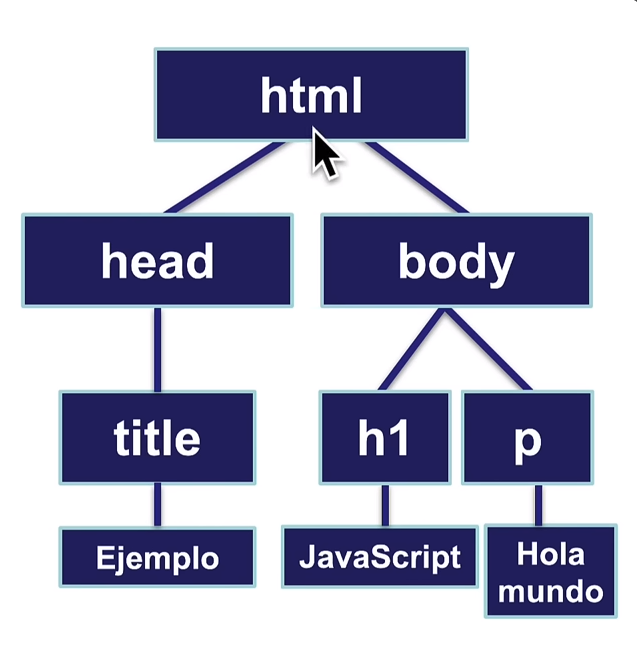
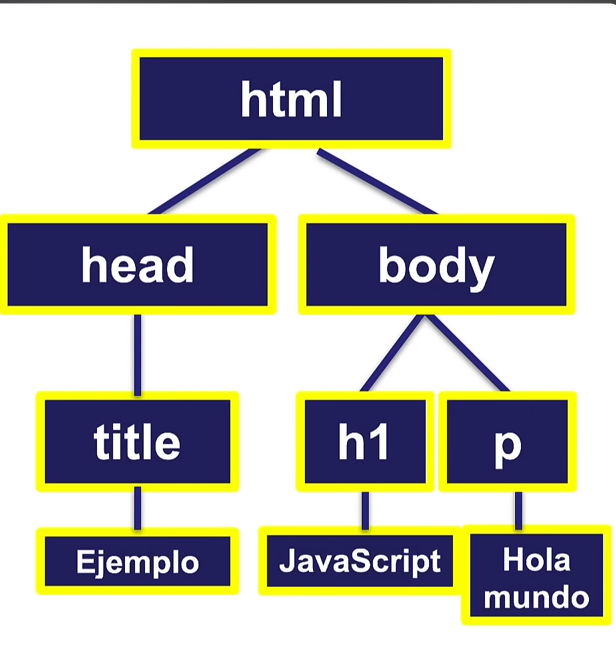
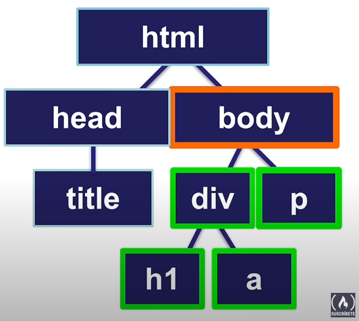
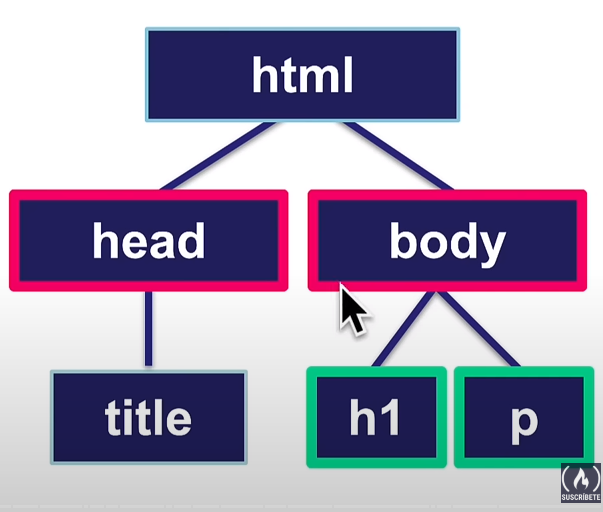

# DOM (Document Object Model)

Representación de los objetos(elementos) que conforman la estructura de un documento en la web.

```html
<!DOCTYPE html>
<html>
    <head>
        <title>Ejemplo</title>
    </head>
    <body>
        <h1>JavaScript</h1>
        <p>Hola Mundo</p>
    </body>
</html>
```
Tenemos la estructura sencilla de un documento html, a partir de este documento tenemos el siguiente diagrama.



En donde lo podemos desglosar para representar el DOM.
Representar el documento HTML a través del DOM nos permite acceder a sus elementos y manipularlos.

El DOM representa a los elementos como **nodos** y **objetos** con los cuales podemos trabajar en JavaScript. Es así que de esta forma podemos trabajar con sus propiedades, métodos y con distintos eventos.

## Composición del DOM 
### Nodos => ELementos Datos.

Un punto específico del diagrama o árbol de nodos del **DOM**.


En esta imagen vemos todos los nodos, estan resaltado con el borde amarillo.

En el nodo se incluyen:

    - Documento
    - Elementos HTML
    - Texto
    - Comentarios

### Objetos => Propiedades y eventos

### Root Node (Nodo raíz)

Es el nodo ubicado en la parte superior del arbol de jerarquia en este caso siempre será el html.

### Parent Node (Nodo padre)

Nodo que contiene a otro nodo en la jerarquia del DOM, por ejemplo: las etiquetas **_head_**, **_body_**

```html
<!DOCTYPE html>
<html>
    <head> => nodo padre
        <title>Ejemplo</title>
    </head>
    <body> => nodo padre
        <h1>JavaScript</h1>
        <p>Hola Mundo</p>
    </body>
</html>
```
### Child Node (Nodo hijo)

Es aque que está contenido directamente dentro de otro nodo, por ejemplo: **_title_**, **_h1_**, **_p_**.

```html
<!DOCTYPE html>
<html>
    <head> => nodo padre
        <title>Ejemplo</title> => nodo hijo
    </head>
    <body> => nodo padre
        <h1>JavaScript</h1> => nodo hijo
        <p>Hola Mundo</p> => nodo hijo
    </body>
</html>
```
### Descendant Node (Nodo descendiente)

Nodo contenido dentro de otro nodo en la jerarquia del **DOM** (directa o indirectamente).


Como se ve en el diagrama, las etiquetas _h1_ y _a_, son nodos descendientes.

### Sibling Nodes (Nodos hermanos)

Nodos ubicados en el mismo nivel de la jerárquia del DOM.


Como se indica en el diagrama, las etiquetas _head_ y _body_ o _h1_ y _p_, son nodos hermanos, por estar en el mismo nivel de jerárquia.

## Nodo vs Elemento

El concepto de nodo es más amplio que el concepto de elemento en el DOM.
Usualmente nos referimos a los elementos del documento HTML como _"elementos"_.

Un nodo puede ser un elemento HTML pero también puede ser texto o comentarios en el documento.

## El DOM en los Navegadores

# Elementos del DOM en JS

## Elementos por ID
### getElementById => Busca un elemento HTML con el id especificado. En principio, un documento HTML bien construído no debería tener más de un elemento con el mismo id, por lo tanto, este método devolverá siempre un solo elemento:

```JS
const page = document.getElementById("page");   // <div id="page"></div>
```
## Elementos por clase
### getElementsByClassName => 

## Elementos por etiqueta
### getElementsByTagName => 

## 

##

## Estilos con JS

## Texto en el DOM

## Clases

### Agregar

### Verificar

### Remover

## Crear Elementos

### Crear elemento

### Remover eliminar elemento

# Recorrer el DOM

# Eventos del DOM

Evento => Es algo que ocurre en el sitio web como resultado de iteracción con el usuario o por otra causa como cambios en el estado del dispositivo o de la ventana.

### Eventos del Cursor

### Eventos del Teclado

#### Elemento target(blanco)

    El elemento target 

#### Trigger

#### Event Handler

    Función que se ejecuta cuando ocurre un evento.

#### Event Listener


